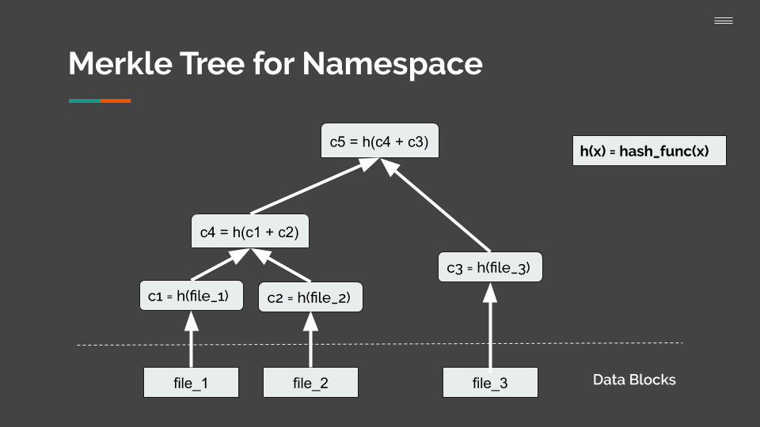

## HashFS

HashFS is a filesystem based on Merkle Tree that allow the filesystem to exist in multiple different versions at the same time. This means that users can mount the filesystem at different versions, make their changes and commit them without corrupting the changes that other users are making.

This is achieved using Merkle Tree which is traditionally used in block chain to verify transactions.


Each write to the filesystem creates a new root node which is used as the version number. There are two ways that the user can interact with the filesystem, it can be through the HashFS FUSE module or the HashFS Shell. For usage, user can mount the file system or enter the interactive shell and selecting a root checksum, after making changes, the new root checksum can be obtained and passed to other users if they wish to access the same version of the filesystem

#### The Cache Server
Acting as a cache layer to HashFS is an HTTP server built with Python Flask. Each cache server can have a parent cache server. This way files can be pushed up to their parent, and if a cache server doesn’t have a file that is requested, it can ask its parent for the file. Although it is not currently implemented, in the future, a cache server will be able to have an online data store as a parent cache, such as an S3 bucket. 

Interfacing with the server is simple. Make a GET request to the server to retrieve a file, and a PUT request to put a file in the cache. Multiple files can be put in the same HTTP request. To help with these operations, there is a caching library called CacheLib. Two additional operations that are supported are push, where you can push a file up to the server’s parent cache, and info, where you can get a JSON file with information about a file in the cache server.

### First time setup

First install virtualenv and install all python packages required.
To install virtual env:
```
cd $HOME
curl --location --output virtualenv-16.4.0.tar.gz https://github.com/pypa/virtualenv/tarball/16.4.0
tar xvfz virtualenv-16.4.0.tar.gz
python pypa-virtualenv-bc1d76d/virtualenv.py hashfs_virtualenv
```
Activate virtualenv and install flask, requests.
```
source ~/hashfs_virtualenv/bin/activate
pip install flask
pip install requests
```
Install python-fuse

HashFS can be mounted as a file system via FUSE.
The implementation uses the Python package `fuse-python`,
which is available through `pip install`.
Due to dependencies on the host machine's `libfuse` installation,
Python might have trouble with library search.
On RHEL7 machines, for example,
`import fuse` fails searching for `libfuse.so.2`.

The easiest fix is to set `RPATH` when installing.
```
pip install --global-option=build_ext --global-option='--rpath=/usr/lib64' fuse-python
````
Before running the Cache Server, the HashFS FUSE module, or the shell, make sure to activate the virtualenv

### Running a Cache Server:
First Navigate to the caching directory
```
cd hashfs/caching
```
Making sure a virtual environment is running with the above dependencies installed, you can now spin up a cache server:
```
Usage: CacheServer.py [options]

Options:
  -h, --help            show this help message and exit
  --port=PORT           Specify a port for the server to run on [default:
                        9999]
  --dir=CACHEDIR        Specify a directory to be used as cache directory
                        [default: /tmp/hashfs]
  --parent-address=PARENT
                        Specify the address for a parent server [default:
                        None]
```
To make requests to a Cache Server running on a different machine, find out the address of the machine the Cache Server is on by running the following command:
```
ifconfig | grep inet | head -n 1 | awk '{print $2}'
```
This address is the host that should be specific when running the FUSE module.

### FUSE Module
To run the FUSE module, make sure there's a caching server running and you've activated
a virtualenv that has flask, requests and fuse installed
``` 
    Usage: A FUSE implementation of HashFS.hashfs_fuse.py [mountpoint] [options]

    Options:
        --version              show program's version number and exit
        -h, --help             show this help message and exit
        -o opt,[opt...]        mount options
        -o root=HASH           Specify a root hash [default: 44136fa355b3678a1146a
                               d16f7e8649e94fb4fc21fe77e8310c060f61caaff8a]
        -o host=HOST           Specify the address of the parent node [default:
                               localhost]
        -o port=PORT           Specify the port to connect to [default: 9999]
        -o local_cache_dir=DIR
                               Specify a local cache directory [default:
                               /tmp/mkfs]
        -o local_run           Run locally, do not put nodes to parent [default:
                               False] 
```

If you wish to write to the filesystem, add -s to disable multithreading

### HashFS Shell
To run the shell, make sure there's a caching server running and you've activated a virtualenv
that has flask, requests, and fuse installed
```
    Usage: hashfs_shell.py [options]

    Options:
      -h, --help            show this help message and exit
      -r ROOT, --root=ROOT  Specify a root hash [default: 44136fa355b3678a1146ad16
                            f7e8649e94fb4fc21fe77e8310c060f61caaff8a]
      -k HOST, --host=HOST  Specify the address of the parent node [default:
                            localhost]
      -p PORT, --port=PORT  Specify the port to connect to [default: 9999]
      -c LOCAL_CACHE, --local-cache=LOCAL_CACHE
                            Specify a local cache directory path [default:
                            /tmp/mkfs]
      -l                    Run file system locally, do not put nodes to parent
                            [default: False]
```

Within the shell, type usage to see all the commands available or see below:
```
Commands:
    GET      [src_path] [dest_path]
    PUT      [src_path] [dest_path]
    LS       [path]
    MKDIR    [path]
    DELETE   [path]
```
A note of the PUT command, please include the name of the file at the destination.

### Demo
1) Starting a cache server to run in the background
```
python caching/CacheServer.py --port=9998 --dir=demoCache >> demoCache_log.txt 2>&1 &
```
2) Create an empty directory to mount the HasFS FUSE module
```
mkdir demoMount
```
3) Run a the FUSE module and connect it to the cache server
```
python hashfs_fuse.py -s -o port=9998 demoMount
```
4) To unmount the file system
```
fusermount -u demoMount
```
4) Kill the cache server
```
ps -ef | grep 'python caching/CacheServer.py --port=9998' | grep -v grep | awk '{print $2}' | xargs kill
```
